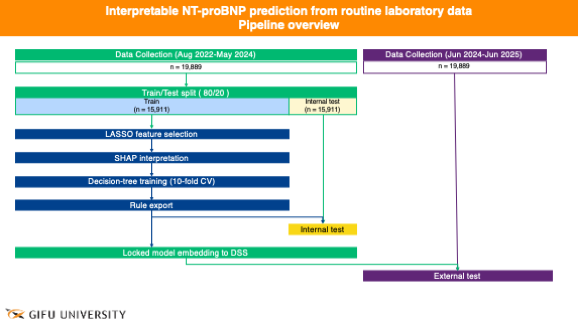

# NT‑proBNP_to_DSS  
*Interpretable NT‑proBNP screening from routine laboratory data*

<p align="center">
  
</p>

[](LICENSE)&nbsp;

---

## 1. Overview
This repository hosts code and artifacts for an interpretable decision‑tree model that predicts elevated NT‑proBNP (≥300 pg/mL) using only routine laboratory tests.  
The model was trained on 19,889 encounters (Aug 2022–May 2024), evaluated on an internal hold‑out set (n = 3,978; AUROC 0.80, F1 70.3%), deployed in Abbott Japan’s Diagnostic Support System (DSS; Japan‑only middleware), and temporally validated on an independent cohort (n = 14,903; Jun 2024–Jun 2025; AUROC 0.81, F1 70.1%).

---

## 2. Key features

|  |  |
|---|---|
| **Interpretable & validated** | Transparent decision tree; AUROC 0.80 / 0.81 and F1 ≈70% (internal / external) |
| **Deployed in practice** | Running inside Abbott Japan’s **DSS**, issuing automated rule‑based comments in daily workflow |
| **Scalable & low cost** | Uses routine labs only; rules are portable to Abbott’s international CDS platforms after platform‑specific validation |

---

## 3. Repository layout

```text
NT-proBNP_to_DSS/
├── README.md
├── requirements.txt
├── LICENSE
├── data/
│   └── sample_data.csv           # small synthetic example
├── models/
│   ├── model.pkl
│   └── standard_scaler.pkl
├── scripts/
│   ├── predict.py                # one-shot inference on CSV
│   └── export_dss_rules.py       # tree → DSS/CDS rule table
├── notebooks/
│   └── Beeswarm_with_LassoCoef_SHAP.ipynb
├── docs/
│   ├── pipeline_overview.png
│   ├── shap_beeswarm.png
│   ├── decision_tree.png
│   └── dss_screenshot.png
└── results/                      # created after running scripts
```

---

## 4. Installation

```bash
git clone https://github.com/HidekazuISHIDA/NT-proBNP_to_DSS.git
cd NT-proBNP_to_DSS
python -m venv .venv && source .venv/bin/activate   # Windows: .venv\Scripts\activate
pip install -r requirements.txt   # tested on Python 3.9.5
```

---

## 5. Quick start (prediction)

```bash
python scripts/predict.py \
  --model models/model.pkl \
  --scaler models/standard_scaler.pkl \
  --input data/sample_data.csv \
  --output results/predictions.csv
```
Outputs a CSV with prediction probabilities (pred_prob) and binary labels (pred_label).

---

## 6. Export roles to DSS / CDS

```bash
python scripts/export_dss_rules.py \
  --model models/model.pkl \
  --output dss_rules.json
```
Generates a machine‑readable rule file for DSS or other middleware.

---

## 7. Data avilability & privacy

Clinical data (19,889 derivation encounters and 14,903 temporal validation encounters) were analyzed under IRB approval (Gifu University Ethics No. 2022‑086) and cannot be released publicly.
A small synthetic dataset (data/sample_data.csv) with the same schema is provided so that all scripts run end‑to‑end. Additional de‑identified data may be available upon reasonable request and ethics approval.

---

## 8. Code availability

All custom code for preprocessing, model training, evaluation, and DSS rule export is included here under the MIT License. The manuscript version is tagged v1.0.0.

---

## 9. Citation

```bibtex
@article{Ishida2025_NTproBNP_DSS,
  title   = {Development of an Interpretable Machine Learning Model for Early Screening of Heart Failure and Its Application to Diagnostic Support Systems},
  author  = {Ishida, Hidekazu and Ohzawa, Noriko and Tachikawa, Masaya and Nagasawa, Hiroki and Shirakami, Yohei and Watanabe, Takatomo and Okura, Hiroyuki and Kikuchi, Ryosuke},
  journal = {npj Digital Medicine},
  year    = {2025},
  note    = {In review},
}
```

---

## 10. DSS / CDS note

DSS (Abbott Diagnostics, Tokyo, Japan) is marketed only in Japan and enables laboratory technologists to append rule‑based interpretive comments to EMRs. Abbott’s international Clinical Decision Support (CDS) platforms (e.g., AlinIQ CDS) target different regulatory workflows. The decision rules provided here are platform‑agnostic and can be ported after validation.

---

## 11. License & diclaimer

Released under the MIT License (see LICENSE).
For research use only. Local validation and regulatory clearance are required before any clinical deployment.

---

## 12. Competing interest & contributions

* Competing interests: H.N. is the Representative Director and President of M2DS Co., Ltd. The other authors declare no competing interests.

* Author contributions: H.I. conceived the study and drafted the manuscript; N.O. and M.T. curated data and validated analyses; H.N. implemented software and integration; Y.S., T.W., and H.O. provided clinical oversight; R.K. supervised the project and finalized the manuscript. All authors approved the final version.

```makefile
::contentReference[oaicite:0]{index=0}

