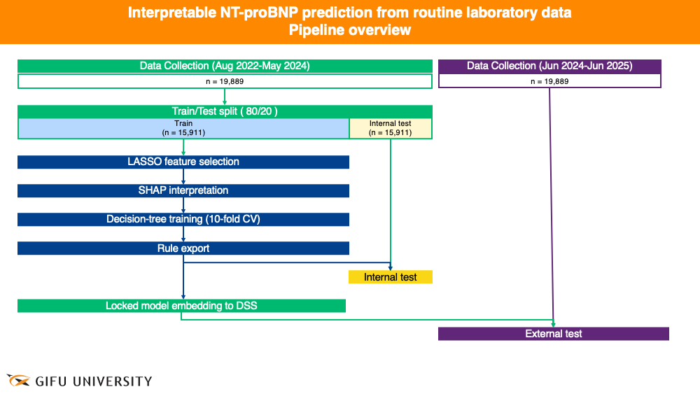

# NT-proBNP_to_DSS
*Interpretable laboratory-data model for risk stratification of elevated NT-proBNP*

<p align="center">
  
</p>

[](LICENSE)

---

## 1. Overview
This repository hosts code and artifacts for an interpretable decision-tree model that **stratifies the risk of** elevated N-terminal pro–B-type natriuretic peptide (NT-proBNP) **> 300 pg/mL** using only routine laboratory tests.

The model was developed to function as a **triage tool** for identifying high-risk patients. It was trained on 19,889 encounters using **all 20 candidate predictors (without LASSO selection)** to capture non-linear associations. The decision threshold was optimized to maintain **high sensitivity (≥0.90)** in the training set. The model was deployed in Abbott Japan’s Diagnostic Support System (DSS) and validated on a temporal external cohort (n = 14,903), demonstrating high sensitivity (**0.882**) and negative predictive value (**0.852**).

---

## 2. Key features

|  |  |
|---|---|
| **High Sensitivity for Triage** | Optimized threshold ensures high sensitivity (~0.88) and NPV (~0.85) to effectively "rule out" low-risk patients. |
| **Interpretable Logic** | Transparent decision tree using raw laboratory values (e.g., Alb, eGFR, Age) without "black-box" transformations. |
| **Deployed in Practice** | Running inside Abbott Japan’s **DSS**, issuing automated rule-based interpretive comments in daily workflow. |
| **Scalable & Low Cost** | Uses routine labs only; rules are portable to Abbott’s international CDS platforms after platform-specific validation. |

---

## 3. Repository layout

```text
NT-proBNP_to_DSS/
├── README.md
├── requirements.txt
├── LICENSE
├── data/
│   └── sample_data.csv           # synthetic example (schema-compatible)
├── model/
│   └── model.pkl                 # Trained DecisionTreeClassifier (scikit-learn)
├── scripts/
│   ├── predict.py                # Inference script (calculates optimal threshold)
│   ├── export_dss_rules.py       # Export tree to DSS/CDS JSON rule format
│   └── make_table2.py            # Reproduce Table 2 metrics
├── notebooks/
│   └── Tree_SHAP_Analysis.ipynb  # SHAP analysis with TreeExplainer
├── docs/
│   ├── pipeline.png
│   ├── shap_beeswarm.png
│   ├── decision_tree.png
│   └── dss_screenshot.png
└── results/                      # Outputs (predictions, tables)
```

---

## 4. Installation

```bash
git clone [https://github.com/HidekazuISHIDA/NT-proBNP_to_DSS.git](https://github.com/HidekazuISHIDA/NT-proBNP_to_DSS.git)
cd NT-proBNP_to_DSS
python -m venv .venv
# Windows: .venv\Scripts\activate
# Mac/Linux: source .venv/bin/activate
pip install -r requirements.txt    # tested on Python 3.9.5
```

---

## 5. Quick start (prediction)

The prediction script automatically applies the sensitivity-optimized threshold determined during training. Note that `StandardScaler` is no longer used, as the decision tree operates on raw values for better interpretability.

```bash
python scripts/predict.py \
  --model model/model.pkl \
  --scaler model/standard_scaler.pkl \
  --input data/sample_data.csv \
  --output results/predictions.csv
```
Outputs a CSV with prediction probabilities (`pred_prob`) and binary labels (`pred_label`).

---

## 6. Evaluation (reproducing Table 2)

This script reproduces the performance metrics reported in the manuscript (Table 2), including AUROC, Sensitivity, Specificity, PPV, and NPV.

```bash
# Recreate Table 2 for Train / Test / External
python scripts/make_table2.py \
  --model model/model.pkl \
  --scaler model/standard_scaler.pkl \
  --train data/train.csv \
  --test data/test.csv \
  --external data/external.csv \
  --out results/table2.csv
```

Outputs: `results/table2.csv` and a console printout mirroring Table 2.

- Index test: decision-tree probability with a fixed decision rule
- Reference standard: NT-proBNP > 300 pg/mL
- Missing data: complete-case only; no imputation

---

## 7. Export rules to DSS / CDS

Use the exporter to convert the trained decision tree into a DSS/CDS-friendly JSON rule file (fixed operating threshold defaults to **0.50**).

**Basic**
```bash
python scripts/export_dss_rules.py \
  --model model/model.pkl \
  --output dss_rules.json
```

With explicit feature names and a custom comment

```bash
python scripts/export_dss_rules.py \
  --model model/model.pkl \
  --output dss_rules.json \
  --threshold 0.50 \
  --feature-names "Sex,Age,Na,K,Cl,TP,Alb,CK,AST,ALT,LD,Cre,UN,WBC,MCV,MCHC,RDWCV,PLT,eGFR" \
  --comment-template "Predicted risk of NT-proBNP > 300 pg/mL is elevated based on routine laboratory parameters. Consider NT-proBNP testing and clinical evaluation for heart failure."
```

Outputs: dss_rules.json with the nested rule tree, leaf class counts/probabilities, and the fixed operating threshold.
See docs/how_to_export_DSS_rules.md
 for JSON schema, deployment notes, and governance checks.

```kotlin

If your README section numbers differ, keep the *same section title* and place this block under that title.
::contentReference[oaicite:0]{index=0}
```

---

## 8. Reporting & STARD

A detailed item-by-item mapping to STARD 2015 is provided in
docs/STARD_mapping.md

---

## 9. Data availability & privacy

De-identified clinical data are not publicly available owing to institutional policy and ethics approval constraints (Gifu University Ethics No. 2022-086). Requests for access to a limited, de-identified analytic dataset for verification will be considered by the Ethics Committee and the corresponding author, subject to a data-use agreement. A synthetic dataset with identical schema is provided so that all scripts run end-to-end. Aggregate outputs (e.g., summary tables underlying Table 2) and model artifacts (final decision tree / DSS rule file) are included in this repository.

---

## 10. Code availability & reproducibility

All custom code for preprocessing, LASSO feature selection, decision-tree training/evaluation, temporal external validation, and DSS rule export is released under the MIT License.
The manuscript version is tagged v1.0.0 (include the Git commit hash when citing a specific revision). Environment details are pinned in requirements.txt.

---

## 11. Citation

```bibtex
@article{Ishida2025_NTproBNP_DSS,
  title   = {Interpretable Laboratory-Data Model to Flag Elevated NT-proBNP and its Deployment in Diagnostic Support Middleware},
  author  = {Ishida, Hidekazu and Ohzawa, Noriko and Tachikawa, Masaya and Nagasawa, Hiroki and Shirakami, Yohei and Watanabe, Takatomo and Okura, Hiroyuki and Kikuchi, Ryosuke},
  journal = {***},
  year    = {***},
  note    = {In review},
}
```

---

## 12. DSS / CDS note

DSS (Abbott Diagnostics, Tokyo, Japan) is marketed exclusively in Japan and enables laboratory technologists to append rule-based interpretive comments to the electronic laboratory report/EHR. Abbott’s international clinical decision support (CDS) platforms target different regulatory workflows. The decision rules here are platform-agnostic and can be ported after platform-specific validation.

---

## 13. License & disclaimer

Released under the MIT License (see LICENSE).
For research use only. Local validation and regulatory clearance are required before any clinical deployment.

---

## 14. Competing interests & contributions

Competing interests. H.N. is the Representative Director and President of M2DS Co., Ltd. The other authors declare no competing interests.
Author contributions. H.I. conceived the study and drafted the manuscript; N.O. and M.T. curated data and validated analyses; H.N. implemented software and integration; Y.S., T.W., and H.O. provided clinical oversight; R.K. supervised the project and finalized the manuscript. All authors approved the final version.

```pgsql
If you want, I can also draft `scripts/make_table2.py` that implements DeLong + Wilson CIs at the fixed 0.50 operating point so the Evaluation section runs out-of-the-box.
::contentReference[oaicite:0]{index=0}
```


