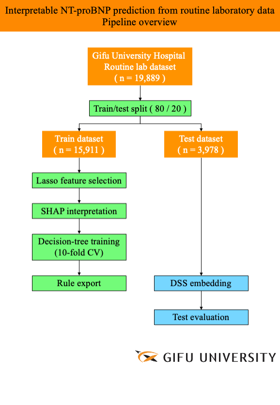

# Heart-Failure DSS  
*Interpretable NT-proBNP prediction from routine laboratory data*

<p align="center">
  
</p>

[](LICENSE)&nbsp;
[](https://doi.org/10.5281/zenodo.XXXXXXX)&nbsp;


---

## 1 Background  
Heart failure (HF) is a major global source of morbidity and cost.  
Although NT-proBNP is the gold-standard biomarker, its assay expense and limited platform availability restrict routine use.  
This repository accompanies our **NEJM AI** manuscript and offers a fully reproducible, *explainable* decision-tree model that predicts NT-proBNP ≥ 300 pg mL⁻¹ from standard chemistry and hematology panels.

---

## 2 Key features  

| | |
|---|---|
| **Interpretable & validated** | Transparent decision tree, AUROC 0.80 • F1 0.70 on a held-out cohort (n = 3 978) |
| **Deployed in practice** | Running inside Abbott Japan’s **Diagnostic Support System (DSS)** and issuing rule-based comments in daily workflow |
| **Scalable & low-cost** | Uses routine labs only; rule file auto-exportable to Abbott’s global **Clinical Decision Support (CDS)** platform |

---

## 3 Repository layout  

```text
├── predict.py               # one-shot inference on CSV
├── train_model.py           # retrain from synthetic CSV
├── export_dss_rules.py      # tree → DSS / CDS rule table
├── model.pkl                # pretrained decision tree
├── sample_data.csv          # 1 000 synthetic rows
├── requirements.txt         # scikit-learn 1.6 • pandas 2.2 • shap
├── docs/
│   ├── pipeline_overview_.png
│   ├── shap_beeswarm.png
│   ├── decision_tree.png
│   └── dss_screenshot.png
└── LICENSE
```

---

## 4 Installation

```bash
git clone https://github.com/HidekazuISHIDA/heart-failure-dss.git
cd heart-failure-dss
python -m venv .venv && source .venv/bin/activate
pip install -r requirements.txt   # Python 3.9 – 3.11
```

---

## 5 Quick interface demo

```bash
python predict.py --data sample_data.csv --model model.pkl
# Expected output
# AUROC : 0.80
# F1    : 0.70
```

---

## 6 Export rules to DSS / CDS

```bash
python export_dss_rules.py --model model.pkl --out dss_rules.csv
```

---

## 7 Data availability & privacy

Clinical data from 19 889 encounters were analysed under IRB 2022-086 (Gifu University) and cannot be shared publicly.
We supply synthetic data (sample_data.csv) with the same schema so every script runs end-to-end.
Researchers seeking the real dataset may contact the corresponding author to arrange a data-use agreement.

---

## 9 Citation

```bibtex
@article{Ishida2025_NTproBNP_DSS,
  title   = {Development of an Interpretable Machine-Learning Model for Early Screening of Heart Failure and Its Application to DSS},
  author  = {Ishida, Hidekazu and Ohzawa, Noriko and Tachikawa, Masaya and others},
  journal = {NEJM AI},
  year    = {2025},
  doi     = {10.1056/NEJMAI.xxxxxxx}
}
```

---

## 10 License & disclaimer

Released under the MIT License.
For research use only; not approved for clinical decision-making without local validation and regulatory clearance.


